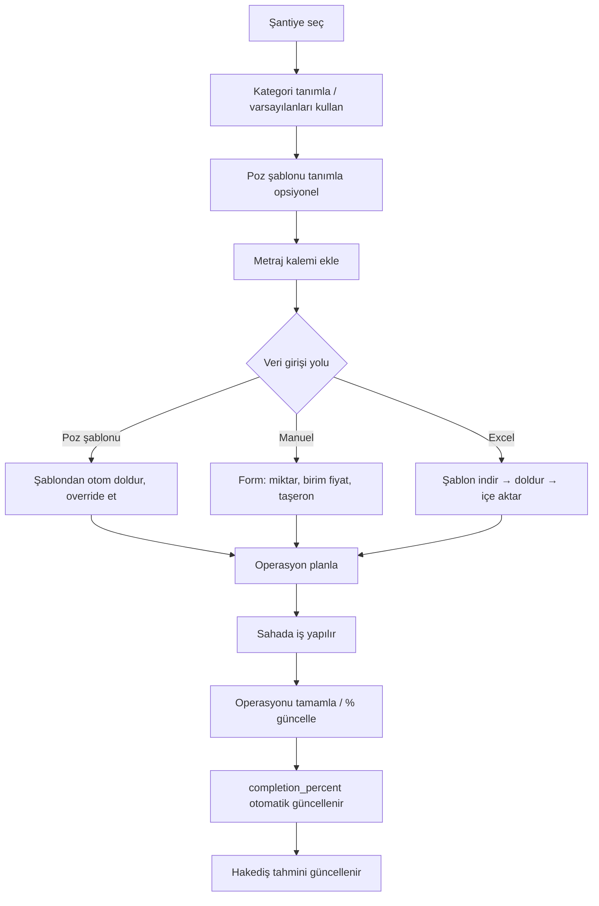
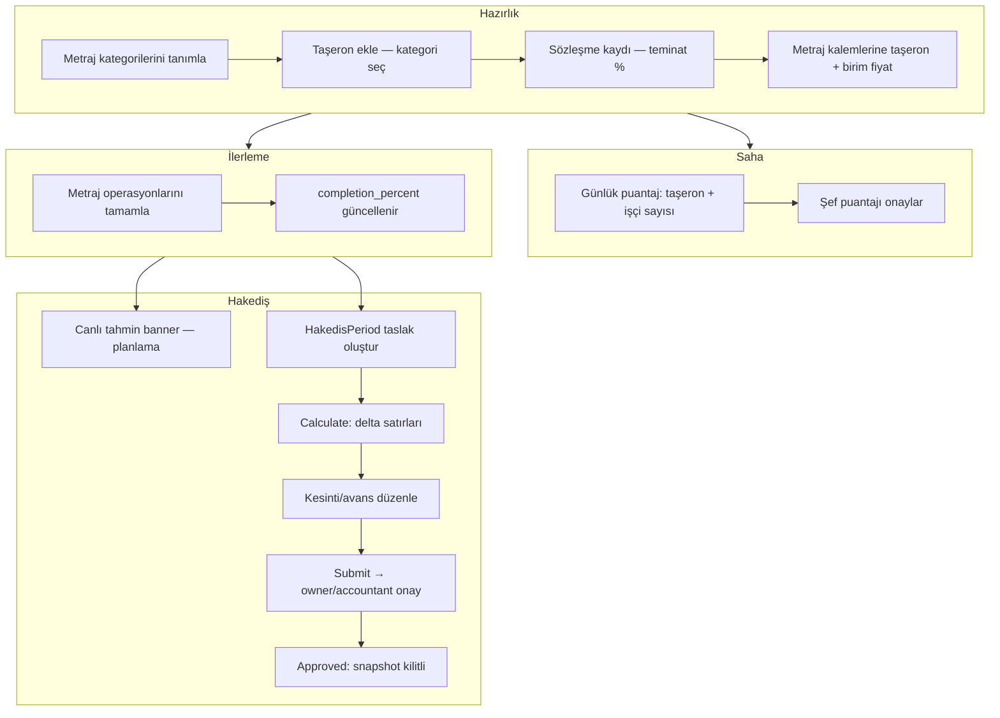
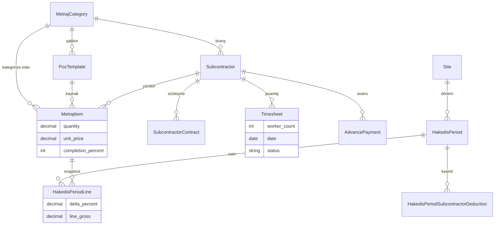

# ConManage — Sistem İş Akışları ve Entegrasyon Rehberi

> **Amaç:** Bu belge, ConManage (eski adı MetrajX) platformunun **mevcut durumunu**, **modüller arası entegrasyonu** ve **inşaat sahası iş mantığını** yapay zekâ veya yeni geliştiricilere aktarmak için yazılmıştır.  
> **Son güncelleme:** 2026-06-21  
> **Master plan (v2):** [`CONMANAGE_MASTER_PLAN_v2.md`](CONMANAGE_MASTER_PLAN_v2.md) — tek kaynak  
> **Eski plan:** `.cursor/plans/conmanage_erp_donusumu_dd4bd6fd.plan.md` (referans)

### Canlı tahmin vs kilitli dönem (Faz A)

| Tür | Kaynak | Kullanım |
|-----|--------|----------|
| **Tahmini hakediş** | `GET /api/puantaj/hakedis/` — anlık `completion_percent × unit_price` | UI önizleme, planlama |
| **Resmi hakediş** | `HakedisPeriod` (approved/paid) — delta snapshot, kilitli | Ödeme, denetim, Faz D cari |

Resmi tutar yalnızca **onaylı hakediş dönemlerinden** gelir. Canlı tahmin metraj ilerledikçe değişir; onaylı dönem snapshot'ı değişmez.

---

## 1. Platform Özeti

ConManage, **şirket → şantiye → modül** hiyerarşisinde çalışan bir inşaat ERP'sidir.

```
Company (Şirket)
  └── Site (Şantiye) — birden fazla
        ├── Metraj & İlerleme (Faz 2) ✅
        ├── Puantaj & Taşeron (Faz 3) ✅
        ├── Dönemsel Hakediş & Sözleşme (Faz A) ✅
        ├── Poz Kütüphanesi (Faz B) ✅
        ├── Donatı Optimizasyonu (legacy alt modül) ✅
        ├── Finans / Cari / Depo (Faz D) ⏳ planlandı
        ├── Şantiye Takvimi (Faz E) 🟡 kısmi (metraj operasyon takvimi var)
        └── Günlük Rapor & Demirbaş (Faz F) ⏳ planlandı
```

**Teknoloji:** Django REST + PostgreSQL (backend), React + Vite + TypeScript (frontend), JWT auth, çoklu dil (TR/EN).

**Veri kapsamı:** Neredeyse tüm iş verileri **seçili şantiye** (`site_id`) üzerinden filtrelenir. Kullanıcı rolüne göre erişilebilir şantiyeler kısıtlanır.

---

## 2. Kimlik, Rol ve Şantiye Seçimi (Faz 1)

### 2.1 Roller

| Rol | Kod | Erişim |
|-----|-----|--------|
| Müteahhit / Owner | `owner` | Tüm şantiyeler, ekip yönetimi, şantiye CRUD |
| Şantiye Şefi | `site_manager` | Yalnızca atandığı şantiyeler (`SiteMembership`) |
| Muhasebe | `accountant` | Tüm şantiyeler (finans modülü gelince ağırlıklı) |

### 2.2 Şantiye seçici

- Frontend: `SiteContext` + `SiteSelector` (sidebar)
- Seçim `localStorage`'da saklanır
- Metraj, Puantaj, Donatı sayfaları **seçili `site_id`** olmadan boş durum gösterir

### 2.3 API filtreleme

- `sites_for_user(user)` — backend'de ortak şantiye queryset'i
- Tüm modül API'leri bu listeyi kullanır

---

## 3. Metraj & İlerleme Modülü (Faz 2 + B)

### 3.1 Veri modeli

| Model | Açıklama |
|-------|----------|
| `MetrajCategory` | Branş/kategori (beton, demir, sıva…). **Şirket bazlı**, kullanıcı özel kategori ekleyebilir |
| `PozTemplate` | Poz kütüphanesi: kategori, açıklama, varsayılan birim/fiyat (Faz B) |
| `MetrajItem` | İş kalemi: miktar, birim, birim fiyat, tamamlanma %, notlar; opsiyonel `poz_template` FK |
| `MetrajOperation` | Kaleme bağlı günlük iş planı (yapılacak / yapıldı), katkı yüzdesi |
| `MetrajDocument` | Kalem veya operasyona bağlı dosya (Excel, PDF, Word, görsel) |

**MetrajItem önemli alanlar:**

- `quantity` — toplam metraj miktarı
- `unit_price` — **bu kalem için taşeron sözleşme birim fiyatı** (hakediş hesabının kaynağı)
- `completion_percent` — iş bitirme yüzdesi (0–100)
- `subcontractor` — bu kalemi yürüten taşeron (opsiyonel FK)
- `poz_template` — poz şablonundan otom doldurma; kalem bazlı override serbest

### 3.2 İlerleme hesabı

Tamamlanan operasyonların `progress_percent` değerleri toplanır → `MetrajItem.completion_percent` (max 100).

```
Servis: backend/metraj/services/progress.py → recalculate_item_completion()
Tetikleyici: Operasyon durumu "done" olunca veya progress_percent güncellenince
```

### 3.3 Metraj iş akışı (kullanıcı)



### 3.4 API uçları (özet)

| Endpoint | İşlev |
|----------|-------|
| `GET/POST /api/metraj/categories/` | Kategori listesi / oluşturma |
| `GET/POST /api/metraj/poz-templates/` | Poz kütüphanesi CRUD |
| `GET/POST /api/metraj/items/?site_id=` | Kalem CRUD |
| `GET/POST /api/metraj/items/{id}/operations/` | Operasyon CRUD |
| `GET /api/metraj/summary/?site_id=` | Özet istatistikler |
| `GET/POST /api/metraj/import/` | Excel içe/dışa aktarma |
| `GET /api/metraj/calendar/?site_id=` | Operasyon takvimi |

### 3.5 Frontend sayfaları

- `/metraj` — `MetrajPage`: kalem tablosu, poz şablonu seçici, inline taşeron/birim fiyat, Excel, özet kartlar
- `/metraj/:id` — `MetrajItemDetailPage`: operasyon tablosu, belgeler, takvim paneli

---

## 4. Puantaj & Taşeron Modülü (Faz 3 + A)

### 4.1 Temel iş kuralı (kritik)

> **Hakediş puantajdan DEĞİL, metraj ilerlemesinden hesaplanır.**  
> **Puantaj yalnızca sahadaki günlük işçi sayısını takip eder.**

Bu ayrım kasıtlıdır ve inşaat mantığına uygundur:

- **MetrajItem** = “ne kadar iş yapıldı / yapılacak” + sözleşme fiyatı + ilerleme %
- **Timesheet** = “bugün sahada kaç işçi vardı” (işçi-gün istatistiği)

### 4.2 Veri modeli

| Model | Açıklama |
|-------|----------|
| `Subcontractor` | Taşeron cari kartı: firma adı, **category (MetrajCategory FK)**, iletişim, aktif/pasif |
| `SubcontractorContract` | Taşeron sözleşmesi: sözleşme no, tutar, kapsam, teminat %, durum, tarihler |
| `Timesheet` | Günlük puantaj: taşeron, tarih, `worker_count`, `status` (pending/approved/disputed), onay alanları |
| `HakedisPeriod` | **Şantiye geneli** dönem belgesi: tarih aralığı, durum, toplamlar, kilit zamanı |
| `HakedisPeriodLine` | Dönem satırı: metraj kalemi snapshot, delta %, brüt tutar |
| `HakedisPeriodSubcontractorDeduction` | Taşeron bazlı kesinti: teminat, avans mahsubu, diğer |
| `AdvancePayment` | Avans ödemesi: tutar, kalan bakiye, FIFO mahsup |

**Subcontractor.category:** Branş artık sabit enum değil; **Metraj modülündeki kategorilerden** seçilir.

**Legacy alanlar kaldırıldı (Faz B):** `Subcontractor.unit_price`, `contract_unit`, `Timesheet.work_quantity`, `Timesheet.metraj_item`.

### 4.3 Hakediş formülleri

#### Canlı tahmin (korundu)

```
Hakediş (kalem) = quantity × (completion_percent / 100) × unit_price
```

**Servis:** `backend/puantaj/services/hakedis.py`  
**API:** `GET /api/puantaj/hakedis/` — UI'da "Tahmini Hakediş" etiketi

#### Resmi dönemsel hakediş (Faz A — delta)

```
line_gross = quantity × ((current_cum_pct - prev_cum_pct) / 100) × unit_price
```

- `prev_cum_pct` = aynı `metraj_item` için son **approved/paid** dönemin `current_cumulative_percent`; yoksa 0
- Onay anında tüm snapshot alanları yazılır; `approved` sonrası dönem **immutable**

**Kesintiler:**

- **Teminat (retainage):** Aktif `SubcontractorContract.retainage_percent` × taşeron dönem brütü
- **Avans:** `AdvancePayment.remaining_balance` FIFO mahsubu; onay sonrası bakiye güncellenir
- **Net:** `net_payable = total_gross - retainage - advance - other`

**Servisler:**

- `backend/puantaj/services/hakedis_period.py` — hesapla, gönder, onayla, kilitle
- `backend/puantaj/services/advance.py` — FIFO avans mahsubu
- `backend/puantaj/services/settlement.py` — geçiş dönemi: işçi-gün + canlı/kilitli özet birleşimi

### 4.4 Onay akışları ve yetkiler

| İşlem | site_manager | owner | accountant |
|-------|:------------:|:-----:|:----------:|
| Puantaj oluştur/düzenle | ✓ | ✓ | — |
| Puantaj onayla | ✓ | ✓ | — |
| HakedisPeriod draft oluştur/hesapla | ✓ | ✓ | — |
| HakedisPeriod submit | ✓ | ✓ | — |
| HakedisPeriod approve / paid | — | ✓ | ✓ |

**Akış:** Şef taslak hazırlar → `pending_approval` → owner/accountant onaylar → **KİLİT** → Faz D cari bağlantısı için hazır.

### 4.5 Puantaj iş akışı (kullanıcı)



### 4.6 API uçları (özet)

| Endpoint | İşlev |
|----------|-------|
| `GET/POST /api/puantaj/subcontractors/?site_id=` | Taşeron listesi / oluşturma |
| `GET/POST /api/puantaj/contracts/?site_id=` | Sözleşme CRUD |
| `GET/POST /api/puantaj/advances/?site_id=` | Avans CRUD |
| `GET/POST /api/puantaj/timesheets/?site_id&year&month` | Puantaj listesi / oluşturma |
| `POST /api/puantaj/timesheets/{id}/approve/` | Puantaj onayı |
| `GET /api/puantaj/hakedis/?site_id=` | **Canlı tahmin** (korundu) |
| `GET/POST /api/puantaj/hakedis-periods/?site_id&year&month` | Dönem listesi / oluştur |
| `POST .../hakedis-periods/{id}/calculate/` | Satırları yeniden hesapla |
| `POST .../hakedis-periods/{id}/submit/` | Onaya gönder |
| `POST .../hakedis-periods/{id}/approve/` | Kilitle + net finalize |
| `GET /api/puantaj/settlement/?site_id&year&month` | Dönemsel özet (işçi-gün + hakediş) |

### 4.7 Frontend

- `/puantaj` — `PuantajPage`
  - **Tahmini hakediş banner** — canlı metraj özeti
  - **Ay/yıl seçici** — puantaj, dönem arşivi filtresi
  - **Günlük Puantaj** sekmesi: tablo, durum rozeti, onay butonu, pagination
  - **Taşeronlar** sekmesi: tablo görünümü, pagination
  - **Hakediş Dönemleri** sekmesi: dönem listesi (draft / onay bekliyor / onaylı / ödendi)
- `HakedisPeriodWizard` — dönem oluşturma, hesaplama, kesinti, gönder/onayla

---

## 5. Metraj ↔ Puantaj Entegrasyonu



### Entegrasyon kuralları

| # | Kural |
|---|-------|
| 1 | Her `MetrajItem` opsiyonel olarak bir `Subcontractor` ile ilişkilendirilebilir |
| 2 | `MetrajItem.unit_price` = o kalemin taşeron sözleşme birim fiyatı |
| 3 | Canlı tahmin = `quantity × (completion_percent/100) × unit_price` |
| 4 | Resmi hakediş = onaylı `HakedisPeriod` delta snapshot'ı |
| 5 | `Timesheet.worker_count` paraya çarpılmaz; yalnızca işçi-gün raporu |
| 6 | Puantaj onayı para hesabına girmez; operasyonel onaydır |
| 7 | Taşeron ve kategori aynı şirkete ait olmalı (serializer doğrulaması) |
| 8 | Poz şablonu kalem oluştururken otom doldurur; alanlar override edilebilir |

### Örnek senaryo

1. Kategori: **Sıva** oluşturuldu  
2. Poz şablonu: **Dış cephe sıvası** — m², 120 ₺  
3. Taşeron: **ABC Sıva Ltd.** → kategori: Sıva, sözleşme %5 teminat  
4. Metraj kalemi: poz şablonundan — 500 m², taşeron: ABC Sıva  
5. İlerleme %50 → **Canlı tahmin** = 30.000 ₺  
6. Puantaj: 15 Haziran, 8 işçi → şef onaylar; **paraya etkisi yok**  
7. HakedisPeriod (1–30 Haziran) oluştur → delta %50 → brüt 30.000 ₺, teminat 1.500 ₺ → net 28.500 ₺  
8. Owner onaylar → snapshot kilitlenir; ilerleme %100 olsa bile bu dönem tutarı değişmez  
9. Sonraki dönem: delta %50 (50→100) → ek 30.000 ₺ brüt

---

## 6. Donatı Optimizasyonu (App Store Uygulaması)

Şantiye başına bir `Project` (rebar_optimizer). Excel import + kesim optimizasyonu.

- **App Store:** `marketplace` app — `AppDefinition` (katalog) + `SiteAppInstallation` (şantiye bazlı kurulum)
- API: `GET /api/marketplace/catalog/?site_id=`, `GET/POST/DELETE .../installations/`
- Yeni şantiye oluşturulunca rebar varsayılan olarak kurulur (geriye dönük uyumluluk)
- Route: `/apps/rebar` (eski `/rebar` yönlendirilir); kurulu değilse Uygulamalar sayfasına yönlendirilir
- Metraj **Demir** kategorisi ile kavramsal bağlantı var; teknik FK entegrasyonu henüz tam değil
- PDF/DXF parse kaldırıldı (Faz 0); yalnızca XLSX

---

## 7. Tamamlanan Fazlar (Durum Özeti)

| Faz | Durum | Not |
|-----|-------|-----|
| **Faz 0** | ✅ Tamamlandı | ConManage rebrand; donatı PDF/DXF kaldırıldı |
| **Faz 1** | ✅ Tamamlandı | RBAC, Site, SiteMembership, şantiye seçici, ekip daveti |
| **Faz 2** | ✅ Tamamlandı | Metraj CRUD, operasyonlar, takvim, Excel, belgeler |
| **Faz 3** | ✅ Tamamlandı | Taşeron, puantaj, metraj-tabanlı hakediş, kategori entegrasyonu |
| **Faz A** | ✅ Tamamlandı | Dönemsel hakediş, sözleşme, avans/kesinti, onaylı puantaj |
| **Faz B** | ✅ Tamamlandı | Poz kütüphanesi, legacy alan temizliği, tablo UI |
| **Faz C** | ✅ Tamamlandı | App Store, DB-driven uygulamalar, `/apps/rebar` |
| **Faz D** | ✅ Tamamlandı | Finans/cari, stok, ödeme, bütçe özeti, hakediş→ledger sync |
| **Faz E** | ✅ Tamamlandı | Bağımsız takvim olayları + birleşik API, `/takvim` |
| **Faz F** | ✅ Tamamlandı | Günlük rapor, demirbaş, fotoğraf yükleme API |
| **Faz G** | ✅ Tamamlandı | Sayfa bilgi ipuçları (PageInfoTooltip) |
| **Faz H** | 🟡 Kısmi | App Store'da yakında modüller (ISG, kalite) — kurulum hazır |

---

## 8. Bundan Sonra Yapılacaklar

### 8.1 Faz H — App Store genişlemesi

- [ ] ISG kontrol listesi modülü (katalogda hazır)
- [ ] Kalite denetimi modülü (katalogda hazır)
- [ ] Kullanıcı seçimine göre yeni uygulama geliştirme

### 8.2 İyileştirmeler

- [ ] Metraj ↔ Donatı (Demir kategorisi) teknik entegrasyon
- [ ] Finans: taşeron bazlı cari ekstre, vendor otomatik oluşturma
- [ ] Günlük rapor fotoğraf galerisi UI
- [ ] Tam responsive audit

---

## 9. Yapay Zekâya Sorulabilecek Örnek Sorular

1. *"Bir taşerona hakediş ödemesi yapılırken canlı tahmin ile onaylı dönem tutarı nasıl ayrılmalı?"*
2. *"Delta hakediş hesabında prev_cumulative_percent yanlış gelirse hangi dönemler etkilenir?"*
3. *"Faz D cari modülü, onaylı HakedisPeriod.net_payable'a nasıl LedgerEntry yazmalı?"*
4. *"Avans FIFO mahsubu birden fazla döneme yayıldığında bakiye tutarlılığı nasıl doğrulanır?"*
5. *"Poz şablonu güncellendiğinde mevcut MetrajItem kayıtları etkilenmeli mi?"*

---

## 10. Önemli Dosya Haritası

| Alan | Dosyalar |
|------|----------|
| Metraj model | `backend/metraj/models.py` (PozTemplate dahil) |
| Metraj API | `backend/metraj/views.py`, `urls.py`, `serializers.py` |
| İlerleme servisi | `backend/metraj/services/progress.py` |
| Puantaj model | `backend/puantaj/models.py` |
| Canlı tahmin | `backend/puantaj/services/hakedis.py` |
| Dönem hakediş | `backend/puantaj/services/hakedis_period.py` |
| Avans mahsubu | `backend/puantaj/services/advance.py` |
| Settlement | `backend/puantaj/services/settlement.py` |
| Yetkiler | `backend/puantaj/permissions.py` |
| Puantaj API | `backend/puantaj/views.py`, `urls.py` |
| Migration Faz A | `backend/puantaj/migrations/0003_faz_a_hakedis_period.py` |
| Migration Faz B | `backend/puantaj/migrations/0004_...`, `backend/metraj/migrations/0010_poztemplate_...` |
| Frontend metraj | `frontend/src/pages/MetrajPage.tsx` |
| Frontend puantaj | `frontend/src/pages/PuantajPage.tsx`, `components/puantaj/HakedisPeriodWizard.tsx` |
| Testler | `backend/puantaj/tests/test_hakedis_period.py`, `test_puantaj_api.py` |

---

## 11. Test ve Doğrulama

```bash
# Backend testleri
cd backend && ./venv/Scripts/python.exe manage.py test puantaj.tests metraj.tests

# Migrasyon
pnpm migrate

# Geliştirme
pnpm dev
```

**Kritik test senaryoları:**

- `test_settlement_uses_metraj_not_timesheet_for_money` — puantaj işçi sayısı parayı etkilemez
- `test_hakedis_period_calculates_delta_not_cumulative` — delta formülü
- `test_hakedis_period_locks_after_approval` — onay sonrası immutability
- `test_advance_deduction_reduces_net_payable` — avans mahsubu
- `test_timesheet_approval_by_site_manager` — puantaj onay yetkisi
- `test_hakedis_approve_requires_owner_or_accountant` — hakediş onay yetkisi

---

*Bu belge canlı dokümantasyondur; yeni fazlar tamamlandıkça güncellenmelidir.*
